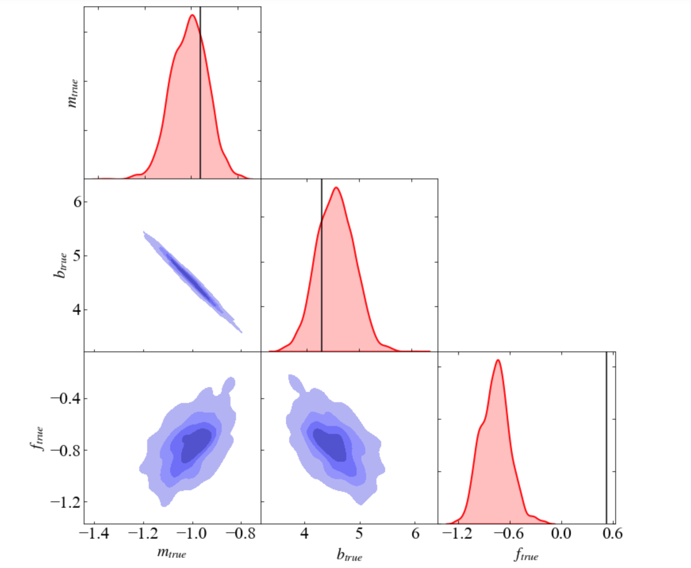

# Tardis
Triangular Distribution Plotting (aka corner plots) for MCMC Sampling Analysis.
This is a very early release of the code, so please create an `issue` or submit a `pull request`.

* Dynamic and Fancy Plotting
* Includes KDE (Kernel Distribution Estimation) for 2-D contours

## Basic installation

The the most recent and stable version can be installed manually, by cloning the repository:

```sh
$ git clone https://github.com/Relativist1/Tardis.git
$ cd Tardis
$ python3 setup.py install
```
## Example

```python
# samples are either imported or directly used after mcmc sampler
from tardis import Tardis
m_true = -0.9594
b_true = 4.294
f_true = 0.534

truths = [m_true, b_true, f_true]
labels = [r"$m_{true}$", r"$b_{true}$",r"$f_{true}$"]

# if Emcee ensemble.sampler is used
samples = sampler.get_chain(flat=True)

Tardis(samples, truths=truths, labels =labels, 
	   savefig='new1.png', diag_shade_color='red',
	   shade=True, truth1d=True, truth2d = False)
```
<p align="left"></p>

## Development
The package is constantly under development.

## More features
Coming soon....

## Contact
sbhkmr199@gmail.com

## License
Tardis is licensed under GPLv3. See LICENSE for more details.
